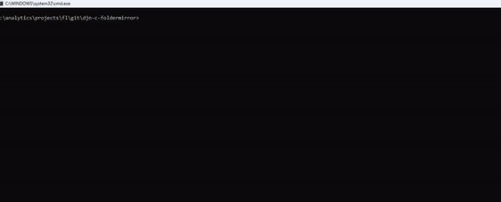

# djn-c-foldermirror
A multithreaded C tool for doing backups of modified files from a source directory to a destination directory. 
Does not delete files in the destination directory. Does not overwrite destination files updated after the source file.
Modular C code that runs only on Windows using a minimal set of Windows API functions.

Compile:-
```sh
%comspec% /k "C:\Program Files\Microsoft Visual Studio\2022\Community\VC\Auxiliary\Build\vcvars64.bat"
cl /O2 folder_mirror.c


%comspec% /k "C:\Program Files\Microsoft Visual Studio\2022\Community\VC\Auxiliary\Build\vcvars32.bat"
cl /O2 folder_mirror.c
```

Help:-
```sh
folder_mirror.exe
Backup directory incrementally. Check for changes using either file size and modified times (default) or using file comparison.

folder_mirror.exe <source-dir> <backup-dir> [-m]

  <source-dir> Specifies the folder containing the source.
  <backup-dir> Specifies the folder storing the backup.
  -c           Compare file contents; otherwise use file size and modified times to test for file changes (default).
  -d           Dry run. No copying of files.
```




